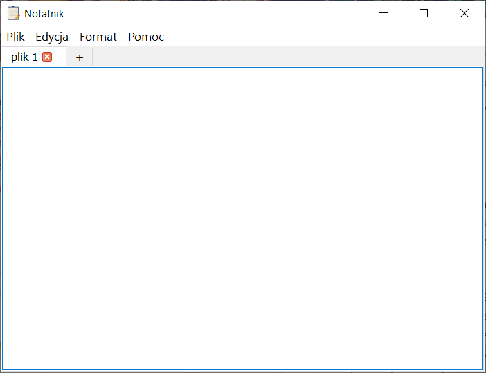
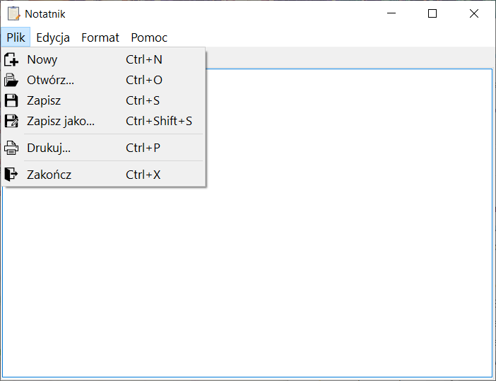
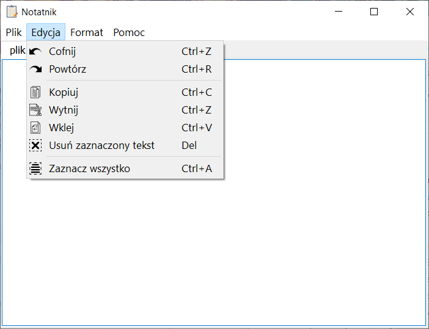
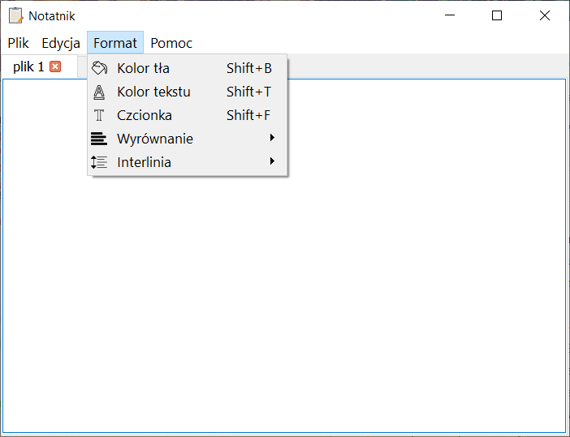
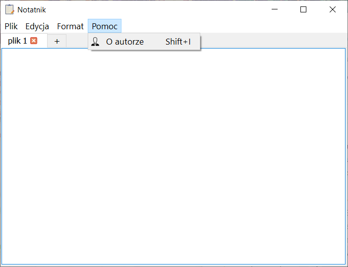

# Notepad

A window application that implements most of the functions of a text editor
based on Windows Notepad.

### Functionality

* new file
* open file
* save file
* print
* exit
* redo
* undo
* copy
* cut
* paste
* select all text
* delete selected text
* set background color
* set text color
* font
* text align
* line spacing
* information about author

In 1 session can be open more than 1 file. </br>
A file can be added or removed using special icons placed in the file bar.

---

## Screenshot
|   |     |    |
|---|:---:|---:|
|  |   |  |
|  |  |  

---

## Technology
* C++11
* qmake
* make
---

## Requirements
* Operation system: Windows, Linux, macOS
* C++11 compiler
* qmake tool installed
* make tool installed
---

## Building & Running
Example for Linux system
```
git clone https://github.com/dmarcini/notepad.git
cd notepad
qmake -o Makefile notepad.pro 
make

cd path/to/build/folder
./notepad
```

---
## Sources
All icons used in this project has been downloaded from: </br>
https://www.flaticon.com/
